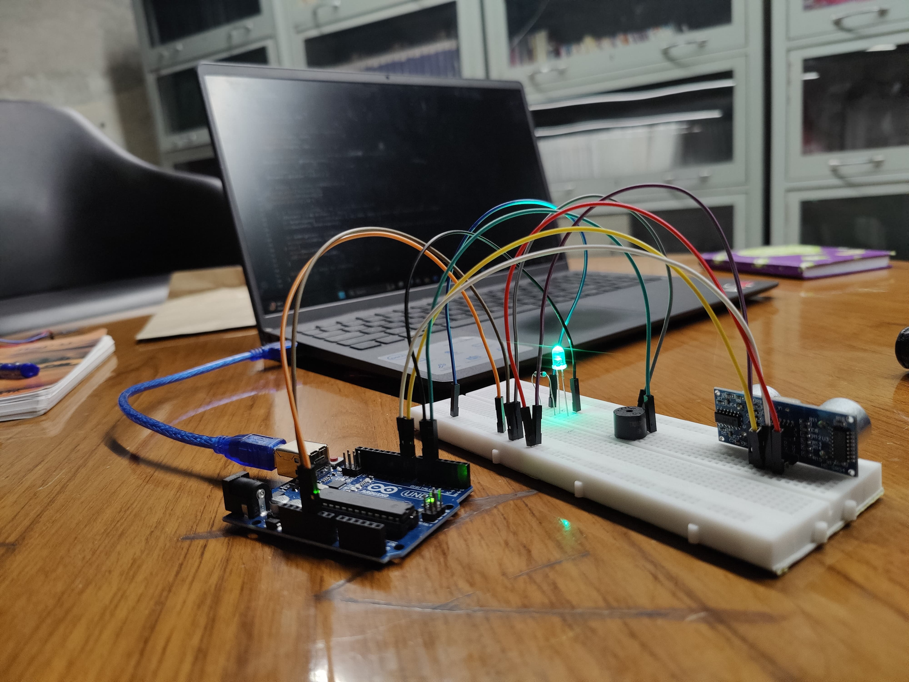
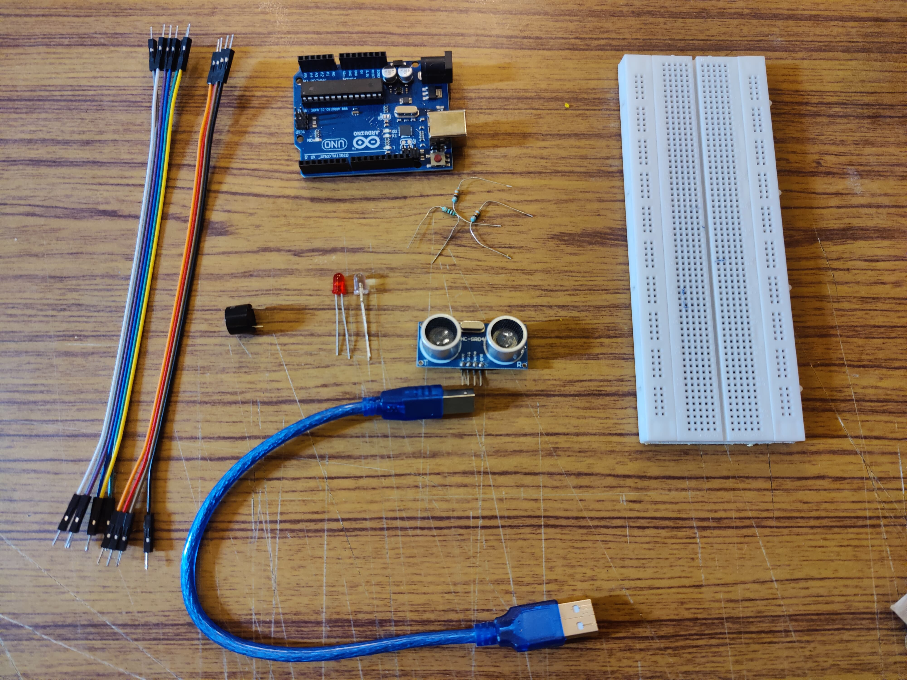
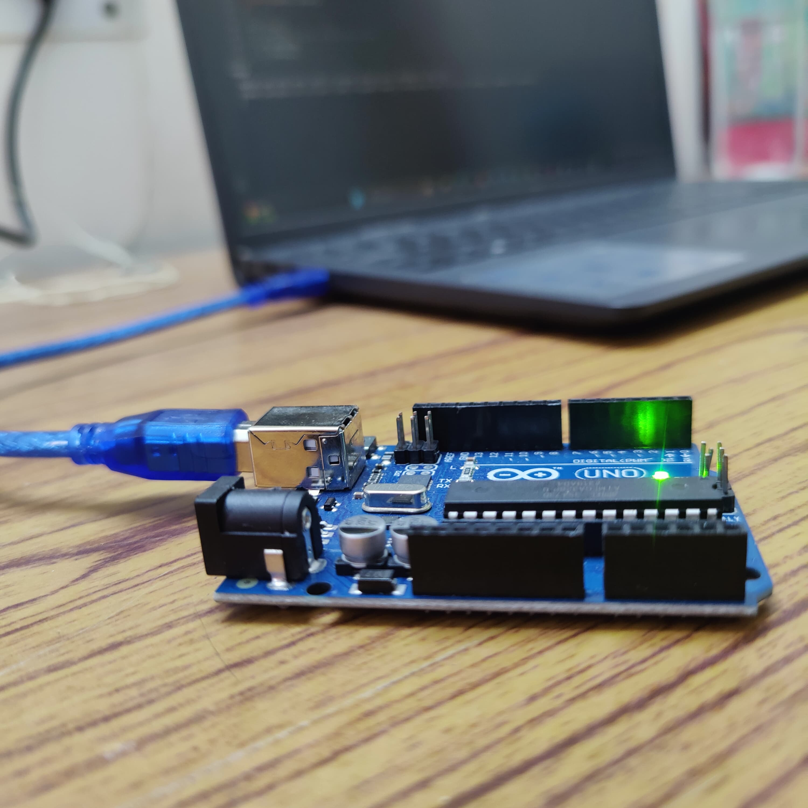

# Ultrasonic Distance Detector 📏🔊

An Arduino-based object detection system using an ultrasonic sensor (HC-SR04), buzzer, and LED. It measures the distance of nearby objects and triggers alerts when the object gets too close. A simple yet effective prototype for proximity-based warning systems.

---

## 🧪 Components Used
- Arduino UNO
- Ultrasonic Sensor (HC-SR04)
- Buzzer
- LED (with 100-ohm resistor)
- Breadboard
- Jumper wires
- USB Cable

---

## ⚙️ How It Works
- The ultrasonic sensor sends out sound waves and listens for the echo.
- Arduino calculates the distance to the object based on time delay.
- If an object is within 20 cm:
  - The buzzer beeps with a pitch based on proximity.
  - The LED lights up, with brightness increasing as the object gets closer.
- The measured distance is also printed to the Serial Monitor.

---

## 📂 Files
- [UltrasonicDistanceDetector.ino](./UltrasonicDistanceDetector.ino) – complete Arduino code

---

## 📷 Real Hardware Implementation

Here are some photos of the actual ultrasonic distance detection project built using Arduino components:

### 🔹 Full Setup

### 🔹 Key Components Used

### 🔹 Code Upload & Testing in Progress

---

## 📌 Possible Use Cases
- Obstacle detection for robots
- Parking assistance systems
- Simple security alarm systems
- Proximity-based automation

---

## 🧑‍💻 Author
Made with hands-on curiosity by **Harshita 💫**
